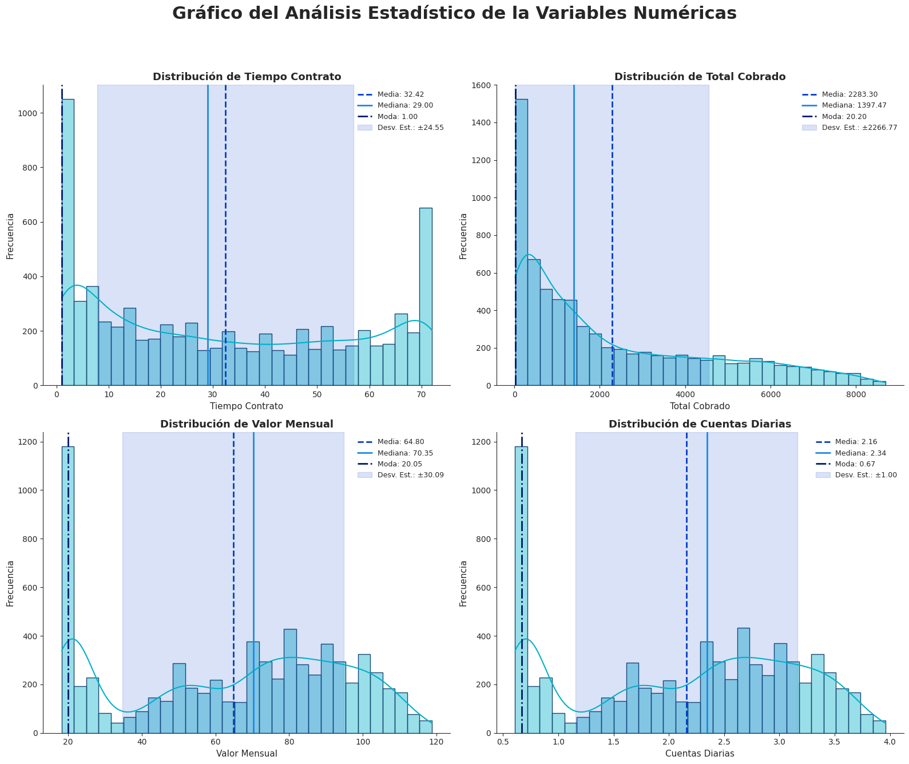
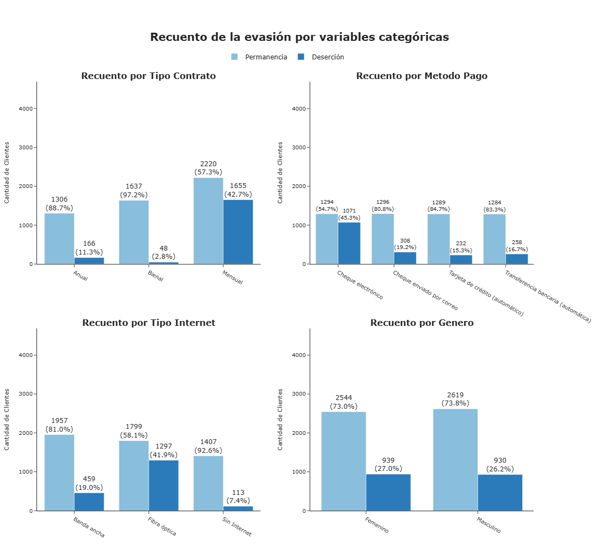
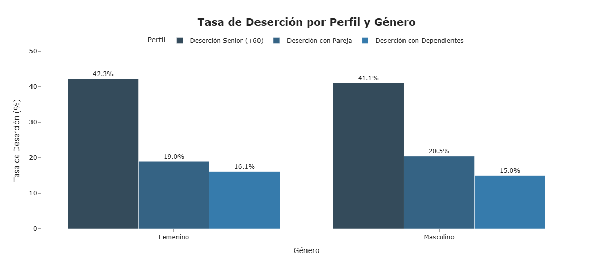
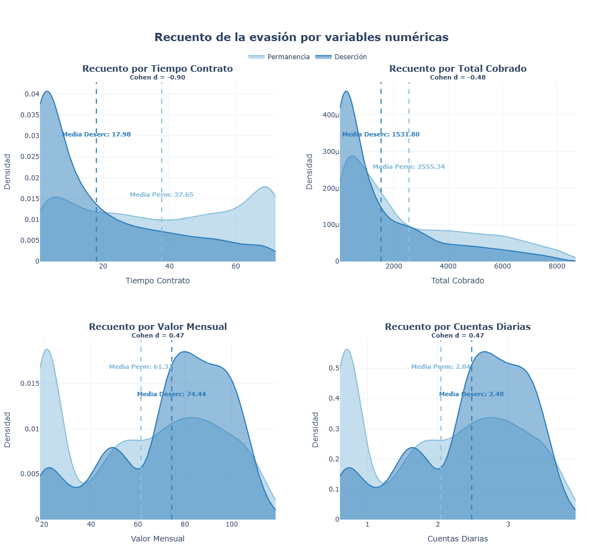
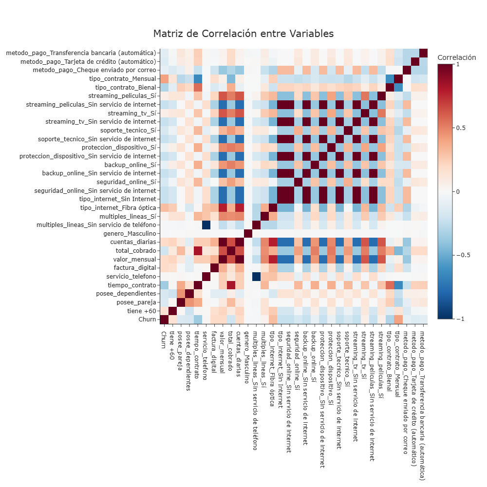

---

# Telecom X LATAM – Análisis Estratégico de Deserción de Clientes
> Proyecto de análisis end-to-end enfocado en identificar clientes de alto riesgo y traducir hallazgos estadísticos en decisiones estratégicas de retención.
---

## Problema de Negocio

Telecom X presenta una **tasa de churn del 26.6%**, es decir, **1 de cada 4 clientes abandona la empresa**.
En modelos de suscripción, la deserción impacta directamente en:

  - Estabilidad de ingresos
  - Eficiencia del costo de adquisición (CAC)
  - Rentabilidad a largo plazo

El objetivo del proyecto fue identificar los principales impulsores de la deserción y proponer estrategias de retención basadas en datos.

---

## Enfoque Analítico

El proyecto sigue una metodología estructurada:

  1. Extracción de datos (API en formato JSON)
  2. Limpieza y transformación
  3. Análisis Exploratorio (EDA)
  4. Análisis estadístico y correlacional
  5. Traducción de hallazgos a insights de negocio
  6. Recomendaciones estratégicas

  ---

## Hallazgos Clave

**1. El Tipo de Contrato es el Predictor Más Fuerte**
     El contrato mensual concentra la mayor tasa de deserción.
     Los contratos anuales y bienales funcionan como ancla de permanencia.

**2. El Ciclo de Vida Temprano es Crítico**
     Los clientes dentro de los primeros 6 meses presentan mayor riesgo.
    Superar el umbral de 12 meses reduce significativamente la probabilidad de fuga.

**3. Paradoja del Cliente Premium**
     Los clientes que pagan más de $70 mensuales presentan mayor tasa de churn.
     El cliente de alto valor es más exigente y menos tolerante a fallos.

**4. Segmento Senior (+60) es el Más Vulnerable**
     Presenta la tasa de deserción más alta (>40%).

**5. Fricción en el Método de Pago**
     Los métodos manuales (Cheque Electrónico) aumentan la probabilidad de abandono.

**6. Servicios Adicionales Reducen la Deserción**
     Soporte Técnico y Seguridad Online actúan como herramientas reales de fidelización.
  
  ---

## Indicadores Cuantitativos Destacados

- Tasa de churn: 26.6%
- Contrato mensual = mayor concentración de fuga
- Correlación negativa fuerte entre antigüedad y deserción
- El ingreso acumulado depende de la retención, no del precio
- Primeros 6 meses = ventana crítica de intervención

---

## Recomendaciones Estratégicas

1. Conversión de contratos mensuales a anuales
2. Programa de retención en los primeros 6 meses
3. Programa de blindaje para clientes de alto ticket
4. Soporte especializado para segmento senior
5. Incentivo a pago automático

---

## Conclusión Final
  - La rentabilidad de Telecom X no depende de subir precios. Depende de retener más tiempo a los clientes correctos. ***El foco no es adquirir más clientes, el foco es moverlos del Mes 1 al Año 1.***
  - La prioridad no es bajar precios, sino aumentar el valor percibido de quedarse. ***Fortalecer el soporte a seniors, incentivar pagos automáticos y proteger los primeros 6 meses, hará que la empresa deje de ser un "comodity" reemplazable para convertirse en un socio esencial del hogar del cliente.***

---

## Tecnologías utilizadas

- **Python 3**
- **Pandas**: manipulación y análisis de datos.
- **NumPy**: operaciones numéricas.
- **Requests**: consumo de APIs y descarga de datos. 
- **Matplotlib**: visualización de datos estática.
- **Seaborn**: visualización de gráficos estadísticos atractivos, complejos e informativos.
- **Plotly**: visualización de datos interactiva y dinámica.
- **Scipy**: análisis estadístico descriptivo e inferencial.
- **Google Colab**: entorno de ejecución y colaboración.

---

## Datos

Los datos fueron obtenidos desde la API pública de Telecom X en formato JSON.
Incluyen información demográfica, servicios contratados y estado de churn de los clientes.  

Fuente:[API de Telecom X](https://raw.githubusercontent.com/alura-cursos/challenge2-data-science-LATAM/main/TelecomX_Data.json) 

--- 
### Diccionario de Datos

| Variable         | Descripción                              |
| ---------------- | ---------------------------------------- |
| customerID       | Identificador único del cliente          |
| Churn            | Indica si el cliente abandonó la empresa |
| gender           | Género (masculino/femenino)              |
| SeniorCitizen    | Cliente mayor o igual a 65 años          |
| Partner          | Indica si tiene pareja                   |
| Dependents       | Indica si tiene dependientes             |
| tenure           | Meses de contrato                        |
| PhoneService     | Servicio telefónico                      |
| MultipleLines    | Más de una línea telefónica              |
| InternetService  | Tipo de servicio de internet             |
| OnlineSecurity   | Seguridad en línea                       |
| OnlineBackup     | Respaldo en línea                        |
| DeviceProtection | Protección del dispositivo               |
| TechSupport      | Soporte técnico                          |
| StreamingTV      | Servicio de TV                           |
| StreamingMovies  | Servicio de películas                    |
| Contract         | Tipo de contrato                         |
| PaperlessBilling | Facturación digital                      |
| PaymentMethod    | Método de pago                           |
| Charges.Monthly  | Cargo mensual                            |
| Charges.Total    | Total gastado                            |

---

## Visualizaciones

### Gráfico del Análisis Estadístico de las Variables Numéricas

### Distribución de la Evasión (Churn) de los Clientes
 de los Clientes.png)

### Recuento de la evasión por variables categóricas.png

### Tasa de Deserción por Perfil y Género.png

### Recuento de la evasión por variables numéricas

### Gráfico del Análisis Estadístico de las Variables Numéricas.png

### Comparativa de Deserción: Ciclo de Vida por Contrato

### Análisis de correlación entre variables

- **Versión interactiva (Plotly)**

---

## Contenido del proyecto

1. **Extracción**
   - Carga de los datos desde la API (JSON).
   - Extracción de datos agrupados.
   - Análisis de la estructura de los datos

2. **Transformación**
   - **Auditoría inicial:**: revisión de tipos de datos, valores nulos y duplicados.
   - **Corrección de Tipos**: conversión de account.Charges.Total a formato numérico (float).
   - **Manejo de Valores Faltantes**: eliminación de 235 registros con datos vacíos.
   - **Traducción y Estandarización**: traducción de columnas y categorías al español.
   - **Estandarización Binaria**: transformación de variables Sí/No a 1 y 0.
   - **Ingeniería de variables**: creación de cuentas_diarias para expresar el gasto mensual en base diaria.

3. **Carga y Análisis**
   El análisis incluyó:
    - **Estadísticas descriptivas**: media, mediana, moda y desviación estándar.
    - **Distribución de Churn**: evaluación de la tasa de deserción.
    - **Análisis por variables categóricas**: tipo de contrato, método de pago, tipo de internet, género, senior (+60), pareja y dependientes.
    - **Comparación de variables numéricas**: tiempo de contrato, total cobrado, valor mensual y cuentas diarias entre clientes que cancelaron y los que permanecieron.
    - **Visualizaciones**: gráficos de barras, histogramas, dispersión y matriz de correlación para identificar patrones y relaciones clave.
  
4. **Informe Final**
   - Introducción
   - Limpieza y Tratamiento de Datos
   - Análisis Exploratorio de Datos (EDA)
   - Conclusiones e Insights
   - Recomendaciones Estratégicas para Reducir la Deserción
   - Conclusión final

---

## Cómo usar este proyecto

1. Abrir el cuaderno en **[Google Colab](https://colab.research.google.com/github/fsoaresg/Desafio-Alura-Store-Latam/blob/main/AluraStoreLatam.ipynb](https://colab.research.google.com/drive/1GmVnMzoH1Scf52kqgmN2oSKKraVXPLgX?usp=sharing)**.
2. Ejecutar las celdas paso a paso para:
  - Importar los datos desde la API.
  - Realizar limpieza y transformación.
  - Generar análisis estadístico y visualizaciones.
3. Explorar los gráficos interactivos.
4. Analizar los insights y evaluar recomendaciones estratégicas.

---

## Estructura del repositorio

├── TelecomX_Churn.ipynb
├── README.md
├── 📂 images/
│   ├── Gráfico del Análisis Estadístico de las Variables Numéricas.png
│   ├── Distribución de la Evasión (Churn) de los Clientes.png
│   ├── Recuento de la evasión por variables categóricas.png
│   ├── Tasa de Deserción por Perfil y Género.png
│   ├── Recuento de la evasión por variables numéricas.png
│   ├── Comparativa de Deserción: Ciclo de Vida por Contrato.png
│   └── Análisis de correlación entre variables.png
├── 📂 interactive/
│   ├── index.html
│   ├── Recuento de la evasión por variables categóricas.html
│   ├── Tasa de Deserción por Perfil y Género.html
│   ├── Recuento de la evasión por variables numéricas.html
│   ├── Comparativa de Deserción: Ciclo de Vida por Contrato.html
│   └── Análisis de correlación entre variables.html

---

## Competencias Demostradas y Posicionamiento Profesional

Este proyecto evidencia capacidad en:

  - Análisis de datos end-to-end
  - Interpretación estadística aplicada a negocio
  - Segmentación de clientes
  - Storytelling con datos
  - Visualización estratégica
  - Traducción de análisis técnico en decisiones ejecutivas
  - Identificar variables críticas en problemas reales de negocio
  - Priorizar acciones con impacto económico
  - Conectar análisis estadístico con estrategia corporativa
  - Comunicar hallazgos técnicos a nivel ejecutivo

---

## Autor

**Fátima Soares**  
Analista de datos, apasionada por la visualización y análisis de métricas, transformando datos en información útil para la toma de decisiones.  
[GitHub](https://github.com/fsoaresg)

---

## Licencia

Este proyecto es de **uso educativo y demostrativo**, con base en un desafío de Alura Latam.
